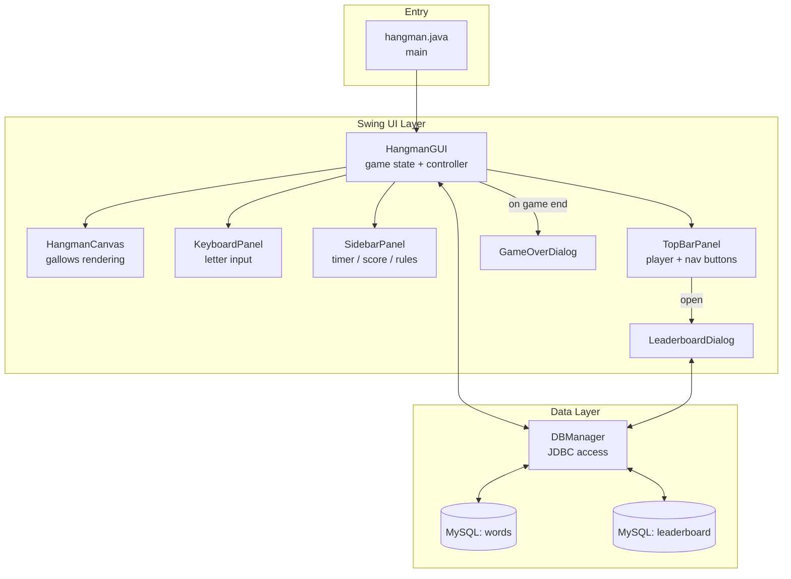
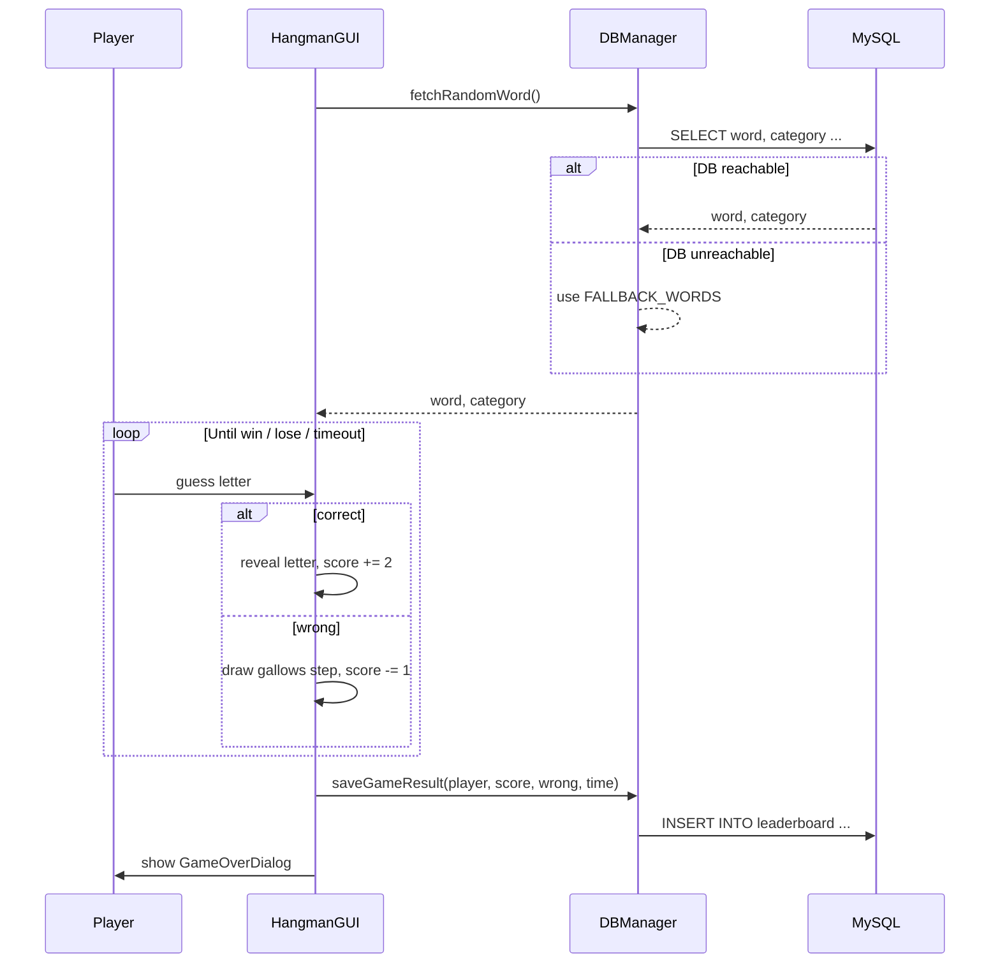

<div align="center">

# 🎮 Hangman
### Java Swing + JDBC Desktop Game

A polished, fully custom-rendered Hangman game — hand-drawn gallows canvas, live QWERTY keyboard, 60-second timer, scoring engine, and a persistent MySQL leaderboard. No external UI libraries, no game engine — just Swing, `Graphics2D`, and JDBC.


</div>

---

## 📖 Table of Contents

- [Overview](#-overview)
- [Features](#-features)
- [Preview](#-preview)
- [Tech Stack](#-tech-stack)
- [Architecture](#-architecture)
- [Project Structure](#-project-structure)
- [Getting Started](#-getting-started)
- [Configuration](#-configuration)
- [How to Play](#-how-to-play)
- [Scoring Rules](#-scoring-rules)
- [Game Flow](#-game-flow)
- [Troubleshooting](#-troubleshooting)

---

## 🕹 Overview

A single-player Hangman game built with **Java Swing, JDBC and MySQL** featuring custom `Graphics2D` rendering, interactive keyboard, 60-second timer, live scoring and a persistent Top 10 leaderboard.

MySQL handles the **random categorized word bank** and **leaderboard data**. If the database is unavailable, the game automatically uses built-in fallback words so gameplay can still continue.

The project keeps game logic, UI components, rendering, input handling and database operations separated into dedicated classes.

---

## ✨ Features

| Feature                   | Description                                                                 |
| ------------------------- | --------------------------------------------------------------------------- |
| 🖌️ **Custom Graphics**   | Hangman drawn live using `Graphics2D` with each mistake adding a new part   |
| ⌨️ **Smart Keyboard**     | Clickable QWERTY keyboard + physical keyboard support with instant feedback |
| ⏱️ **60-Second Timer**    | Real-time countdown that ends the round when time runs out                  |
| ⭐ **Dynamic Scoring**     | `+2` for correct guesses · `−1` for wrong guesses                           |
| 🏷️ **Random Word Bank**  | Categorized words fetched randomly from MySQL                               |
| 🏆 **Top 10 Leaderboard** | Scores saved to MySQL and ranked by score + completion time                 |
| 🛟 **Database Fallback**  | Built-in words keep gameplay running when MySQL is unavailable              |
| 🔁 **Skip & Replay**      | Start a fresh word anytime or instantly play another round                  |
| 🎨 **Modern UI**          | Clean dark theme with indigo, purple and amber accents                      |

---

## 🖼 Preview

▶️ **[Watch Hangman Game Demo](https://github.com/Subhanjeet/miniProjects/releases/tag/hangman-v1.0)**

---

## 🛠 Tech Stack

| Layer               | Technology                             |
| ------------------- | -------------------------------------- |
| 💻 **Language**     | Java (JDK 8+)                          |
| 🎨 **GUI**          | Java Swing + AWT                       |
| 🖌️ **Graphics**    | `Graphics2D` for custom rendering      |
| 🗄️ **Database**    | MySQL 8                                |
| 🔌 **Connectivity** | JDBC + MySQL Connector/J               |
| 🏗️ **Build**       | Plain `javac` — no build tool required |

---

## 🏗 Architecture



**Design Pattern:** `HangmanGUI` works as the **main controller**, managing the word, score, attempts, timer and communication between UI components. `DBManager` handles all **JDBC and MySQL operations**, keeping database logic separate from the game UI.

---
## 📁 Project Structure

```text
Hangman/
│
├── hangman.java             # Application entry point
├── HangmanGUI.java          # Main game window and game logic
├── HangmanCanvas.java       # Custom Hangman graphics using Graphics2D
├── KeyboardPanel.java       # QWERTY keyboard and input handling
├── SidebarPanel.java        # Timer, score and wrong guesses
├── TopBarPanel.java         # Player info and game controls
├── LeaderboardDialog.java   # Top 10 leaderboard display
├── GameOverDialog.java      # Win/lose result and replay
└── DBManager.java           # MySQL connection and database operations
```

**Class Responsibilities**

| Class               | Responsibility                                       |
| ------------------- | ---------------------------------------------------- |
| `hangman`           | Starts the application                               |
| `HangmanGUI`        | Controls game logic, score, timer and UI             |
| `HangmanCanvas`     | Draws the Hangman using `Graphics2D`                 |
| `KeyboardPanel`     | Handles letter input and keyboard feedback           |
| `SidebarPanel`      | Displays timer, score and wrong guesses              |
| `TopBarPanel`       | Handles player info, leaderboard and skip            |
| `LeaderboardDialog` | Displays Top 10 leaderboard                          |
| `GameOverDialog`    | Shows win/lose result and replay options             |
| `DBManager`         | Handles MySQL connection, words and leaderboard data |

---

## 🚀 Getting Started

### Prerequisites

- JDK 8 or higher
- MySQL Server (running locally, or reachable over network)
- [MySQL Connector/J](https://dev.mysql.com/downloads/connector/j/) `.jar` on your classpath

### 1. Clone

```bash
git clone https://github.com/Subhanjeet/miniProjects.git
cd miniProjects/Hangman
```

### 2. Set up the database

```sql
-- ============================================================
-- Hangman Database Schema matching to my MySQL Workbench Setup
-- ============================================================

CREATE DATABASE IF NOT EXISTS hangman_db;
USE hangman_db;

-- 1. Words Table
CREATE TABLE IF NOT EXISTS words (
    id INT AUTO_INCREMENT PRIMARY KEY,
    word VARCHAR(100) NOT NULL UNIQUE,
    category VARCHAR(100)
);

-- 2. Leaderboard Table
CREATE TABLE IF NOT EXISTS leaderboard (
    id INT AUTO_INCREMENT PRIMARY KEY,
    player_name VARCHAR(100) NOT NULL,
    score INT NOT NULL,
    wrong_guesses INT NOT NULL,
    time_seconds INT NOT NULL,
    played_at TIMESTAMP DEFAULT CURRENT_TIMESTAMP
);

-- 3. Initial Sample Words
INSERT IGNORE INTO words (word, category) VALUES
-- Programming
('JAVA', 'Programming'),
('PYTHON', 'Programming'),
('JAVASCRIPT', 'Programming'),
('DATABASE', 'Programming'),
('ALGORITHM', 'Programming'),
('REACT', 'Programming'),
('SPRING', 'Programming'),

-- Technology
('NETWORK', 'Technology'),
('LAPTOP', 'Technology'),
('MONITOR', 'Technology'),
('COMPUTER', 'Technology'),
('SOFTWARE', 'Technology'),
('KEYBOARD', 'Technology'),

-- Animals
('ELEPHANT', 'Animal'),
('GIRAFFE', 'Animal'),
('TIGER', 'Animal'),
('LION', 'Animal'),
('PENGUIN', 'Animal'),
('DOLPHIN', 'Animal'),
('KANGAROO', 'Animal'),
('CROCODILE', 'Animal'),
('GORILLA', 'Animal'),
('BUTTERFLY', 'Animal'),
('OCTOPUS', 'Animal'),
('CHEETAH', 'Animal'),

-- Nature
('MOUNTAIN', 'Nature'),
('RIVER', 'Nature'),
('FOREST', 'Nature'),
('DESERT', 'Nature'),
('WATERFALL', 'Nature'),
('VOLCANO', 'Nature'),
('RAINBOW', 'Nature'),
('THUNDER', 'Nature'),
('SUNFLOWER', 'Nature'),
('OCEAN', 'Nature'),
('ISLAND', 'Nature'),

-- Sports
('CRICKET', 'Sport'),
('FOOTBALL', 'Sport'),
('BASKETBALL', 'Sport'),
('TENNIS', 'Sport'),
('BASEBALL', 'Sport'),
('HOCKEY', 'Sport'),
('VOLLEYBALL', 'Sport'),
('BADMINTON', 'Sport'),
('SWIMMING', 'Sport'),
('WRESTLING', 'Sport'),
('CYCLING', 'Sport'),
('BOXING', 'Sport'),

-- Food
('PIZZA', 'Food'),
('BURGER', 'Food'),
('SANDWICH', 'Food'),
('CHOCOLATE', 'Food'),
('PANCAKE', 'Food'),
('NOODLES', 'Food'),
('POPCORN', 'Food'),
('BIRYANI', 'Food'),
('ICECREAM', 'Food'),
('PINEAPPLE', 'Food');

-- Verify contents
SELECT * FROM words;
SELECT * FROM leaderboard;
```

> 💡 **No MySQL available?** No problem — the game automatically switches to **18 built-in words across 6 categories**, so you can still play without database setup


### 3. Compile & run

```bash
javac -cp .;ysql-connector-j-8.x.x.jar *.java
java  -cp .;ysql-connector-j-8.x.x.jar hangman
```

---

## ⚙ Configuration

Connection settings currently live directly in `DBManager.java`:

```java
private static final String URL = "jdbc:mysql://localhost:3306/hangman_db";
private static final String USER = "root";
private static final String PASSWORD = "your_password";
```

> ⚠️ **Security Note:** Database credentials should never be committed to GitHub. Use **environment variables** or a local untracked config file for your MySQL username, password and connection details


```java
private static final String URL      = System.getenv().getOrDefault("HANGMAN_DB_URL", "jdbc:mysql://localhost:3306/hangman_db");
private static final String USER     = System.getenv().getOrDefault("HANGMAN_DB_USER", "root");
private static final String PASSWORD = System.getenv("HANGMAN_DB_PASSWORD");
```

...and add a `.gitignore` entry for any local config file you introduce.

---

## 🎯 How to Play

1. Enter your **player name** — a random word and category are loaded from MySQL or the fallback list
2. Guess letters using the **on-screen keyboard** or your physical keyboard
3. Correct guesses reveal letters and give **+2 points**
4. Wrong guesses add a Hangman part and cost **−1 point**
5. Complete the word before **6 wrong guesses** or the **60-second timer** runs out
6. Your result is saved to MySQL — open **🏆 LEADERBOARD** to view the Top 10
7. Use **⟳ SKIP** anytime to start a new round

---

## 🎯 Scoring Rules

| Event | Points |
|---|---|
| ✅ Correct letter | **+2** |
| ❌ Wrong letter | **−1** |
| 🏆 Leaderboard rank | by score, then by fastest time |

Game ends at **6 wrong guesses** or when the **60s timer** hits zero — whichever comes first.

---

## 🔄 Game Flow



---

## 🐛 Troubleshooting

| Problem                                            | Likely Cause                                             | Fix                                                         |
| -------------------------------------------------- | -------------------------------------------------------- | ----------------------------------------------------------- |
| `ClassNotFoundException: com.mysql.cj.jdbc.Driver` | MySQL Connector/J is missing                             | Add the Connector/J `.jar` to your classpath                |
| Game uses fallback words                           | MySQL is unavailable or connection details are incorrect | Check MySQL is running and verify `DBManager.java` settings |
| Leaderboard is empty                               | No results saved yet or table is missing                 | Complete a game and verify the `leaderboard` table exists   |
| `Access denied for user 'root'@'localhost'`        | Incorrect MySQL password                                 | Update the `PASSWORD` value in `DBManager.java`             |
| `Communications link failure`                      | MySQL Server is not running or wrong port                | Start MySQL and check that it is running on port `3306`     |

---
