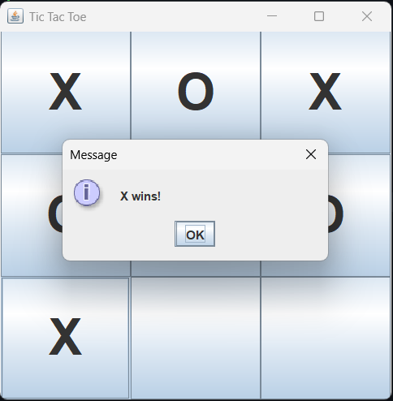
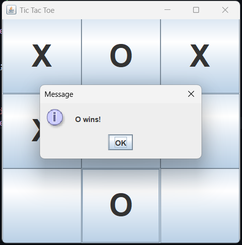
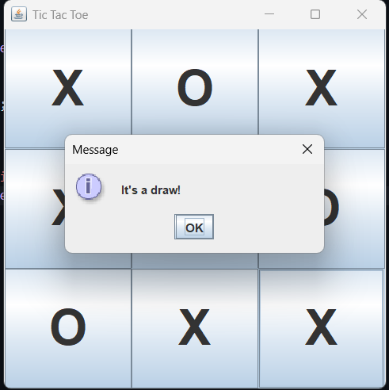

<div align="center">

# 🎮 Tic Tac Toe

### classic 2-player tic tac toe, built with java swing


*click a box → X and O take turns → first to 3 in a row wins*

</div>

---

## 📚 Table of Contents

- [Features](#-features)
- [Demo](#-demo)
- [Getting Started](#-getting-started)
- [Tech Stack](#-tech-stack)
- [Project Structure](#-project-structure)
- [How It Works](#-how-it-works)
- [Roadmap](#-roadmap)


---

## ✨ Features

| Feature | Description |
|---|---|
| 🟦 3x3 Grid | built using `JButton[]` inside a `GridLayout(3,3)` |
| 🔁 Auto Turns | swaps between X and O after every valid move |
| 🏆 Win Detection | checks all 8 win patterns — rows, cols, both diagonals |
| 🤝 Draw Detection | catches a full board with no winner |
| 💬 Popup Results | `JOptionPane` announces the winner or draw |
| ♻️ Auto Reset | board clears itself after every round, ready for a rematch |

---

## 🎥 Demo

<div align="center">
  

  
  
  
  
</div>

---

## 🚀 Getting Started

### Prerequisites
- JDK 8 or higher installed
- that's it — no external libraries, no build tools needed

### Compile
```bash
javac TicTacToe.java
```

### Run
```bash
java TicTacToe
```

a 400x400 window pops up and you're playing.

---

## 🛠 Tech Stack

- **Language:** Java
- **GUI:** Java Swing (`JFrame`, `JButton`, `JOptionPane`, `GridLayout`)
- **Pattern:** single-class, event-driven with `ActionListener`

---

## 📁 Project Structure

```
TicTacToe/
├── TicTacToe.java
├── assets/
│   ├── X_Win.png
│   ├── O_Win.png
│   └── Draw.png
└── README.md
```

---

## ⚙️ How It Works

1. clicking a button fills it with `X` or `O` depending on whose turn it is
2. after every move, `checkWinner()` loops through 8 possible winning patterns
3. if no winner and no empty boxes left, `checkDraw()` triggers a draw popup
4. `resetGame()` clears all buttons and resets to X's turn

```java
int[][] winningPatterns = {
    {0,1,2}, {3,4,5}, {6,7,8},   // rows
    {0,3,6}, {1,4,7}, {2,5,8},   // cols
    {0,4,8}, {2,4,6}             // diagonals
};
```

---

<div align="center">

made with ☕ and java swing

</div>